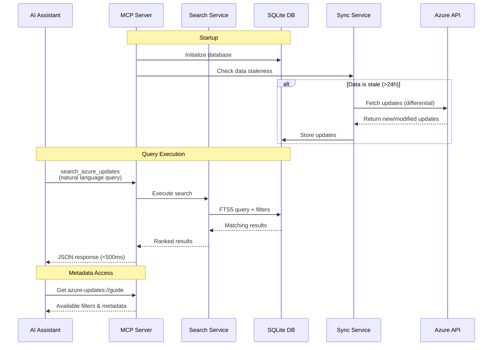

# Azure Updates MCP Server

> **Natural language search for Azure service updates without OData syntax**

An MCP (Model Context Protocol) server that provides AI assistants with seamless access to Azure service updates, retirements, and feature announcements. Search across 9,000+ updates using natural language queries—no OData syntax required.

[](https://www.typescriptlang.org/)
[](https://nodejs.org/)
[](./LICENSE)

## Features

✨ **Natural Language Search** - Query with plain English like "Show me security retirements in 2026"  
🔍 **Keyword Matching** - Full-text search across titles and descriptions with BM25 relevance ranking  
🎯 **Simplified Filtering** - Filter by tags, categories, products, dates, and status—no OData knowledge needed  
⚡ **Fast Response** - Local SQLite replication ensures <500ms query response times  
🔄 **Automatic Sync** - Differential synchronization keeps data fresh (configurable interval, default 24h)  
📊 **Rich Metadata** - Expose all available filters and data freshness to help AI construct queries  
🛡️ **Type-Safe** - Built with TypeScript strict mode for reliability

## Quick Start

### Installation

**Option 1: Run with npx (Recommended)**

```bash
npx azure-updates-mcp-server
```

The server starts immediately with tools available. Background sync runs automatically if data is stale (>24h).

**Option 2: Global Install**

```bash
npm install -g azure-updates-mcp-server
azure-updates-mcp-server
```

**Option 3: Local Development**

```bash
git clone https://github.com/your-org/azure-updates-mcp-server.git
cd azure-updates-mcp-server
npm install
npm run build
npm start
```

### MCP Client Configuration

See [Client Configuration Guide](./docs/client-configuration.md) for setup instructions for Claude Desktop, Continue.dev, Cline, and other MCP clients.

## Configuration

Configuration is done via environment variables. Create a `.env` file or set environment variables:

| Variable | Default | Description |
|----------|---------|-------------|
| `DATABASE_PATH` | `~/.azure-updates-mcp/azure-updates.db` | Path to SQLite database |
| `SYNC_STALENESS_HOURS` | `24` | Sync if data older than this many hours |
| `SYNC_ON_STARTUP` | `true` | Enable/disable startup sync check |
| `DATA_RETENTION_START_DATE` | `2022-01-01` | Retain updates from this date onwards (ISO 8601: YYYY-MM-DD) |
| `LOG_LEVEL` | `info` | Log level: debug, info, warn, error |
| `LOG_FORMAT` | `json` | Log format: json or pretty |

See [.env.example](./.env.example) for all configuration options.

## Usage

### Available Tools

#### `search_azure_updates`

Search, filter, and retrieve Azure updates using natural language queries or structured filters.

**Key Parameters:**
- `query`: Natural language or keyword search
- `id`: Fetch specific update by ID
- `filters`: Tags, categories, products, dates, status, availability ring
- `limit`: Max results (1-100, default: 50)

**Example:**
```json
{
  "query": "OAuth authentication security",
  "filters": {
    "tags": ["Security"],
    "dateFrom": "2025-01-01"
  },
  "limit": 10
}
```

For more examples, see the `azure-updates://guide` resource (distributed through MCP protocol).

## Architecture



Local SQLite replication with FTS5 full-text search provides fast queries (<500ms). Differential sync keeps data fresh from Azure Updates API.

**Technology Stack:**
- **MCP SDK**: `@modelcontextprotocol/sdk`
- **Database**: `better-sqlite3` with FTS5
- **Testing**: Vitest with TypeScript strict mode
- **Runtime**: Node.js 18+

## Development

See [Development Guide](./docs/development.md) for setup, testing, and contributing instructions.

## Troubleshooting

See [Troubleshooting Guide](./docs/troubleshooting.md) for common issues and solutions.

## Documentation

- [Client Configuration](./docs/client-configuration.md) - MCP client setup
- [Development Guide](./docs/development.md) - Contributing and testing
- [Troubleshooting](./docs/troubleshooting.md) - Common issues
- [Azure Updates API Manual](./docs/azure-updates-api-manual.md) - API reference

## License

MIT License - see [LICENSE](./LICENSE) file for details.
